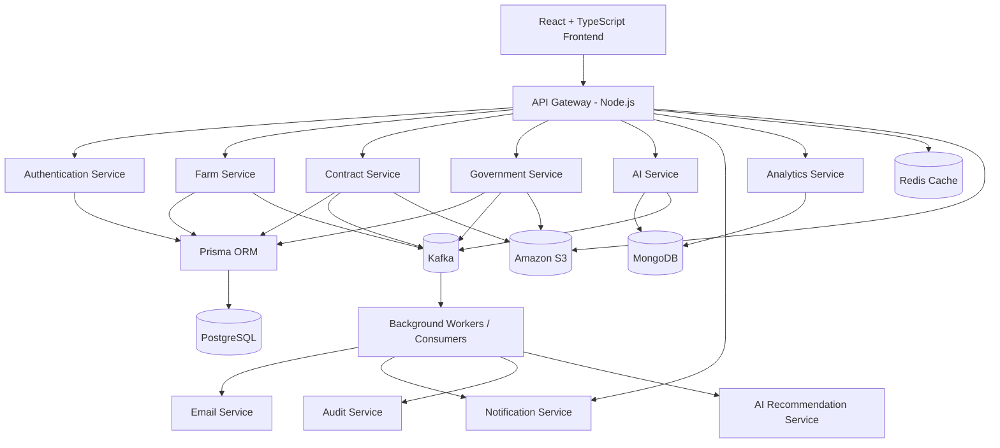

# Architecture

This document describes the **target production architecture** for AgroConnect.

## 1) High-Level System Design

---

## 2) Service Responsibilities

| Service | Responsibility |
|---|---|
| API Gateway | Routing, auth middleware, rate limiting, request validation |
| Authentication | Signup/login, OTP, JWT issuance, RBAC enforcement |
| Farm Service | Farm onboarding, updates, soil/farm metadata, document references |
| Contract Service | Proposal creation, acceptance flow, contract lifecycle |
| Government Service | Identity/document verification, approvals, fraud/dispute handling |
| AI Service | Chat assistant, translation, recommendations, scoring insights |
| Notification Service | Email/SMS/push event delivery |
| Analytics Service | Reports, KPIs, dashboards, trend insights |

---

## 3) Data Architecture

### PostgreSQL (Relational Core)

Use for strongly related transactional data:

- Users (farmers, contractors, officers)
- Farms and land metadata
- Proposals and contracts
- Approvals and statuses
- Payments and notifications

### MongoDB (Flexible Documents)

Use for semi-structured/high-variation data:

- AI chat conversations
- Recommendation payloads
- Activity and audit logs
- Extended event metadata

### Redis (Low-Latency Layer)

- OTP/session caching
- Frequently searched farm result sets
- Dashboard cache snapshots
- AI response caching

---

## 4) Event-Driven Communication (Kafka)

### Suggested Topics

- `FarmerRegistered`
- `FarmVerified`
- `ProposalCreated`
- `ProposalAccepted`
- `ContractApproved`
- `DocumentUploaded`
- `NotificationSent`
- `AIRecommendationGenerated`
- `ContractCompleted`

### Consumers

- Notification processor
- Email processor
- Analytics aggregator
- AI recommendation worker
- Audit/log compliance worker

This event model reduces direct service coupling and improves scalability/reliability.

---

## 5) Storage Strategy (Amazon S3)

Proposed bucket prefixes:

- `/farm-images/`
- `/aadhaar/`
- `/land-documents/`
- `/contracts/`
- `/soil-reports/`
- `/govt-approvals/`
- `/company-documents/`

Recommended controls:

- Signed URLs for temporary document access
- Server-side encryption
- Object lifecycle rules
- Strict IAM policies per service

---

## 6) End-to-End Workflows

### A) AI Workflow

1. Farmer uploads farm details/documents
2. AI extracts key metadata (soil/location/crop context)
3. Soil quality and weather-informed analysis is generated
4. Contractor matching is ranked
5. Income/profit range estimate is produced
6. Government subsidy suggestions are attached
7. Farmer receives personalized recommendations

### B) Contractor Workflow

1. Company registers and submits verification docs
2. Government verifies contractor profile
3. Contractor searches and filters farms
4. AI ranks candidate farms by risk/productivity
5. Contractor sends proposal
6. Farmer accepts/rejects
7. Government approval is processed
8. Digital contract is generated and activated

### C) Government Workflow

1. Farmer/company registration enters review queue
2. Aadhaar/land documents are verified
3. Land and profile approvals are recorded
4. Contracts are monitored for policy adherence
5. Disputes/complaints are managed
6. District/state reports are generated
7. Agricultural statistics feed decision dashboards

---

## 7) Security and Compliance Controls

- JWT-based auth + RBAC by role
- bcrypt hashing for user passwords
- HTTPS/TLS enforcement
- Input validation and schema checks
- Rate limiting and abuse prevention
- Audit logs for all approval actions
- Encryption for sensitive files/fields
- Fraud/anomaly detection signals from AI models

---

## 8) Deployment Topology

- Frontend: Vercel
- Backend/API services: Render
- Databases: PostgreSQL + MongoDB Atlas
- Cache: Redis managed instance
- Messaging: Kafka cluster
- Storage: AWS S3
- Packaging: Docker
- Orchestration: Kubernetes

> This architecture is designed for iterative rollout and can be implemented in phases as detailed in `docs/roadmap.md`.
